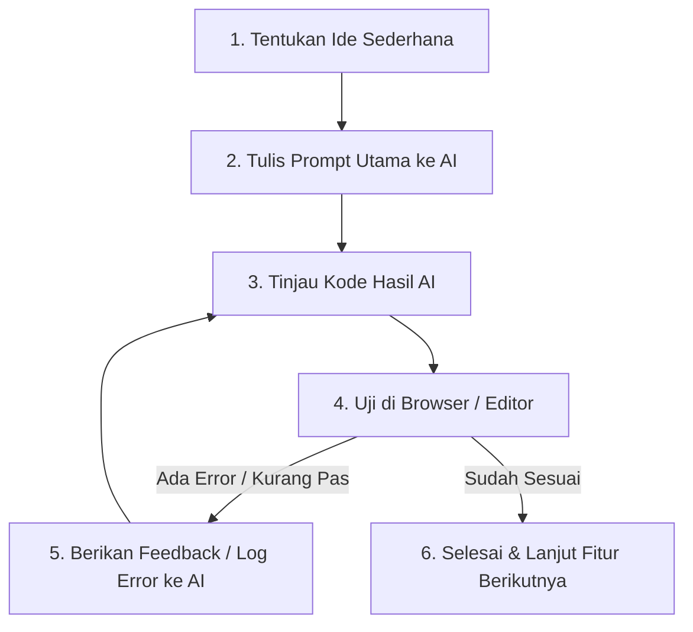

Pernahkah kamu ingin membuat website atau aplikasi sendiri, tetapi mundur karena merasa menghafal kode (*syntax*) itu terlalu sulit dan membingungkan?

Jika iya, kamu berada di era yang tepat! Saat ini hadir paradigma baru dalam dunia *software development* yang dikenal dengan sebutan **Vibe Coding**. Dengan pendekatan ini, kamu tidak lagi harus memulai dari menghafal setiap baris kode dari nol. Sebagai gantinya, kamu bisa mengarahkan asisten kecerdasan buatan (*Artificial Intelligence* / AI) untuk menuliskan kodenya, sementara kamu fokus pada **logika, ide, dan solusi masalah**.

Artikel ini adalah panduan lengkap *vibe coding* khusus untuk pemula. Kita akan membahas dari dasar hingga bagaimana kamu bisa mengeksekusi proyek pertamamu hari ini juga!

---

## 1. Apa Itu Vibe Coding?

**Vibe Coding** adalah istilah yang menggambarkan gaya pemrograman modern di mana kita memanfaatkan *AI Coding Assistant* (seperti Antigravity, Cursor, GitHub Copilot, atau Claude) untuk menulis, menguji, dan memperbaiki kode program berdasarkan instruksi bahasa sehari-hari (bahasa alami).

Jika gaya koding tradisional ibarat menjadi seorang **tukang batu** yang menyusun batu bata satu per satu secara manual, maka *vibe coding* ibarat menjadi seorang **arsitek atau sutradara**:
1. Kamu yang menentukan **visi dan tujuan** aplikasi (*apa yang ingin dibuat*).
2. Kamu yang menyusun **instruksi (*prompt*)** agar AI mengeksekusi ide tersebut.
3. Kamu yang **memeriksa hasil kerja AI**, mengujinya di layar, dan memberikan umpan balik (*feedback*) jika ada yang perlu diperbaiki.

---

## 2. Mengapa Vibe Coding Cocok untuk Pemula?

Bagi pemula—termasuk santri, siswa, dan pembelajar mandiri—hambatan terbesar dalam belajar pemrograman biasanya adalah:
- Terlalu banyak titik koma (`;`) atau kurung kurawal (`{}`) yang terlewat sehingga program *error*.
- Membingungkan dalam memilih dari mana harus mulai menulis kode.
- Sulit memvisualisasikan bagaimana hasil kode tampil di dunia nyata.

*Vibe coding* menjembatani hambatan tersebut dengan keuntungan berikut:

| Koding Tradisional | Vibe Coding dengan AI |
| :--- | :--- |
| Wajib menghafal sintaksis dari awal. | Fokus pada penyampaian ide dan alur logika. |
| Butuh waktu lama untuk melihat hasil prototipe. | Hasil prototipe aplikasi tampil dalam beberapa menit. |
| Mencari bug secara manual baris demi baris. | AI mendeteksi dan menjelaskan penyebab *error* secara cepat. |
| Belajar teori yang abstrak dahulu baru praktek. | *Learning by doing* (langsung buat sambil paham kodenya). |

---

## 3. Peran Kamu saat Melakukan Vibe Coding

Meskipun AI mampu mengetik ratusan baris kode dalam hitungan detik, **bukan berarti kamu lepas tangan sepenuhnya**. AI masih memerlukan arahan yang jelas agar tidak menghasilkan kode yang salah atau tidak sesuai kebutuhan.

Di sinilah peran utama kamu sebagai *vibe coder*:

### A. Penentu Arah (*Context Provider*)
AI tidak tahu apa yang ada di dalam pikiranmu kecuali kamu menjelaskannya. Kamu bertugas memberikan latar belakang aplikasi, siapa penggunanya, dan fitur apa saja yang wajib ada.

### B. Penguji Kualitas (*Reviewer & Tester*)
Setiap kode yang dibuat oleh AI harus kamu jalankan di browser atau aplikasi. Jika tampilannya berantakan atau kodenya mengalami *crash*, kamu memberi tahu AI titik kesalahannya.

### C. Pembelajar Aktif (*Continuous Learner*)
Jangan hanya menyalin (*copy-paste*) kode tanpa dibaca. Luangkan waktu sejenak untuk memperhatikan struktur kode yang dihasilkan AI. Tanyakan pada AI jika ada baris kode yang belum kamu pahami.

---

## 4. Formula Prompt Efektif (Metode C-A-R-E)

Kunci sukses *vibe coding* terletak pada kualitas instruksi (*prompt*) yang kamu berikan kepada AI. Supaya AI memberikan hasil yang akurat, gunakan formula **C-A-R-E**:

1. **C - Context (Konteks)**: Jelaskan proyek apa yang sedang kamu buat dan teknologi yang digunakan.
2. **A - Action (Aksi)**: Sebutkan tugas spesifik yang harus dikerjakan AI saat ini.
3. **R - Requirements (Kebutuhan/Batasan)**: Tentukan aturan khusus, misalnya responsif di HP, warna tema, atau penggunaan library tertentu.
4. **E - Example / Expected Output (Contoh/Hasil)**: Gambarkan bagaimana hasil akhir atau respon yang kamu harapkan.

### Contoh Prompt yang Kurang Efektif (Terlalu Umum):
> *"Buatkan saya halaman login."*

### Contoh Prompt yang Efektif (Metode C-A-R-E):
> *"Saya sedang membuat aplikasi web sederhana menggunakan HTML dan Tailwind CSS (Context). Tolong buatkan komponen form login yang rapi dan modern (Action). Form harus berisi input Email, kata sandi, tombol 'Masuk', serta tombol 'Lupa Password' (Requirements). Buat tampilannya berada tepat di tengah layar (center) dengan latar belakang bernuansa gelap (Expected Output)."*

---

## 5. Langkah-Langkah Memulai Vibe Coding Pertama Kamu

Siap mencoba? Berikut adalah alur kerja (*workflow*) sederhana yang bisa kamu ikuti:

### Langkah 1: Siapkan Perangkat Kerja
1. Install **VS Code** (atau gunakan editor terintegrasi AI seperti Cursor / Antigravity).
2. Siapkan AI assistant pilihanmu.

### Langkah 2: Mulai dari Fitur Paling Sederhana
Jangan langsung meminta AI membuat "Aplikasi E-Commerce Lengkap". Pecah proyek menjadi bagian-bagian kecil:
- Hari ini: Buat tampilan Header dan Banner Utama.
- Besok: Buat daftar produk.
- Lusa: Buat tombol keranjang belanja.

### Langkah 3: Eksekusi & Uji
Salin kode dari AI ke file proyekmu, lalu buka di web browser. Apakah tampilannya sudah sesuai harapan?

### Langkah 4: Tangani Error Tanpa Panik
Jika muncul pesan *error* merah di konsol browser atau terminal, jangan panik! Cukup *copy* pesan *error* tersebut dan kirimkan ke AI dengan kalimat:
> *"Kode tadi menghasilkan error ini: [tempel pesan error di sini]. Tolong jelaskan penyebabnya dan perbaiki kodenya."*

---

## 6. Tips Penting Agar Tetap Menjadi Programmer yang Cerdas

Supaya kamu tidak sekadar menjadi "penyalin kode" tanpa pemahaman, terapkan 3 tips penting ini:

1. **Selalu Minta Penjelasan**: Jika AI menghasilkan fungsi yang terlihat asing, tanyakan: *"Bisa jelaskan baris kode ini berfungsi untuk apa dengan bahasa yang sederhana?"*
2. **Lakukan Commit / Backup Berkala**: Sebelum meminta AI merombak banyak hal, simpan kodenya terlebih dahulu (bisa menggunakan Git atau salinan folder backup). Jika hasil baru kurang bagus, kamu bisa kembali ke versi sebelumnya dengan mudah.
3. **Latihan Berpikir Logis**: Keterampilan terpenting seorang pemrogram bukan mengetik cepat, melainkan kemampuan memecahkan masalah (*problem solving*). Latihlah caramu memecah masalah besar menjadi komponen-kommonen kecil.

---

## Kesimpulan

**Vibe coding** telah membuka pintu lebar-lebar bagi siapa saja yang ingin masuk ke dunia teknologi tanpa terkendala oleh rumitnya sintaksis di awal. Bagi kamu pemula di Baricode Indonesia, ini adalah kesempatan emas untuk langsung berkarya dan mewujudkan ide-idemu menjadi aplikasi nyata.

Ingat, AI adalah alat pelipat ganda kemampuanmu—bukan pengganti kreativitas dan rasa ingin tahumu. Mulailah dari proyek kecil, nikmati prosesnya, dan bangun *vibe* belajarmu hari ini!

---

> **Ingin belajar lebih dalam?** Ikuti berbagai artikel tutorial dan materi bimbingan pemrograman dasar lainnya di [Baricode Indonesia](/artikel)!
